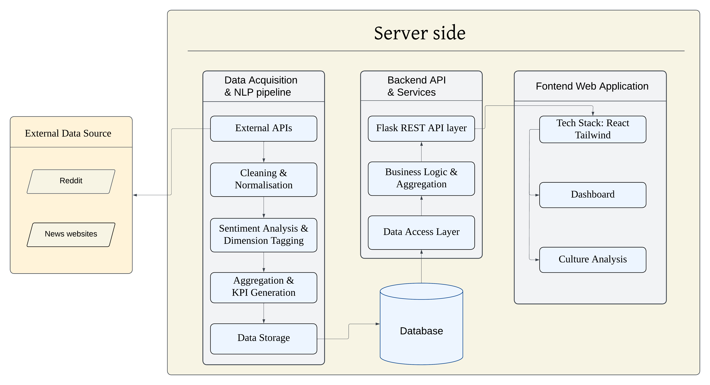

# Corporate Culture Monitor
This repository contains the full-stack AI-powered Corporate Culture Monitor platform developed for the UNSW COMP9900 capstone project. It follows a monorepo structure.


## Project Background
Commissioned by Rio Tinto, we developed an automated system to monitor, analyze, and report corporate culture signals in external public opinion using Natural Language Processing and generative AI, providing a high-level overview of relevant external cultural signals. This system aggregates posts, news articles, sentiment indicators, and dimensional summaries to help users quickly understand the corporate culture atmosphere. Subsequently, through structured narratives, risks, opportunities, and recommendations, it guides leadership from a macro-level cultural overview to granular, topic-specific interpretations, supporting data-driven cultural analysis and decision-making.

## Project Scope
Data Acquisition & NLP Pipeline
The system acquires data from social media (such as Reddit) and well-known news outlets (such as The Guardian), ensuring data legitimacy and authority through official APIs. It removes spam/harmful information and standardizes fields such as timestamps, authors, and text. Multi-model ensembles (such as VADER, RoBERTa, and DistilBERT) are used to perform sentiment classification and confidence calculations on comment evidence levels. A two-stage "recall + rearrangement" pipeline (Bi-encoder ensemble and Cross-encoder) maps content to cultural dimensions and sub-topics. Monthly or source-based KPIs, such as sentiment ratio, sentiment balance index (SBI), and eNPS, are calculated. Finally, all processed information is stored, providing a consistent data source for the backend API.

System Architecture
The backend uses the Flask REST API layer to handle requests, business logic, aggregations, and communicate with the database.The frontend uses the React and Tailwind technology stack to build the web application.

Core Features/UI
Dashboard Overview: Provides a quick, high-level view of cultural signals, including post feeds, sentiment statistics, dimensional distribution, and a Sentiment Balance Index (SBI) trend line.
Sentiment Trends: Summarizes monthly sentiment patterns (positive, negative, balanced signals), visually displaying how the sentiment climate changes over time.
Dimension Explorer: Displays the distribution of cultural dimensions (such as leadership, safety, trust, and communication) in radar chart and ranked list formats.
Post Explorer: Provides a detailed reading experience for individual posts or articles, including metadata, full text, and comments, to trace sentiment drivers.
AI-Generated Insights: Offers multi-level, AI-generated insights on the "Culture Analytics" page, including: Executive Briefing: Summarizes the overall cultural climate. Risks & Opportunities: Highlights recurring cultural risks and potential opportunities. Actionable Recommendations: Provides practical, data-driven suggestions.


## Project Structure

```
capstone-project-25t3-9900-f18a-donut/
├─ .github/workflows                              # Setup CI workflow for backend pytest
│
├─ backend/                                       # Backend service layer (Flask API & model pipeline)
│  ├─ app.py                                      # Main entry point of the backend, initializing the Flask app and loading all routes.
│  ├─ config.py                                   # Configuration file defining paths, constants, and model locations.
│  ├─ models.py                                   # Data models and structures used across the backend.
│  ├─ routes.py                                   # Defines all API endpoints, handling frontend requests and returning JSON responses.
│  ├─ utils.py                                    # Utility functions used across the backend for data loading, formatting, and helper tasks.
│  ├─ requirements.txt                            # Python dependencies for backend 
│  ├─ tests/..                                    # Backend unit tests for validating the NLP pipeline, data processing, and report generation modules.                          
│  ├─ addmapping.py                               # Add or update mapping rules between subthemes and dimensions
│  ├─ compare.py                                  # Compare outputs or data across different versions or runs
│  ├─ data_process.py                             # Core data cleaning and preprocessing workflow
│  ├─ data_process_llm.py                         # LLM-based data processing and text generation logic
│  ├─ download_models.py                          # Download and initialize required NLP/ML models
│  ├─ train_cr_encoder.py                         # Train the cultural-related text encoder model   
│  ├─ sentiment_dbcheck.py                        # Validate sentiment database consistency and integrity
│  ├─ mapping_sub2dim.py                          # Map subthemes → representatives → cultural dimensions
│  ├─ subtheme_classify_cluster.py                # Classify and cluster subthemes into meaningful groups
│  ├─ pipeline.py                                 # Main entry point for running the full NLP pipeline
│  ├─ subthe_dimen_core.py                        # Core logic for loading, aggregating, and structuring subtheme/dimension data
│  ├─ subthe_dimen_llm.py                         # LLM-powered expansion and reasoning for subthemes/dimensions
│  ├─ subthe_dimen_sr.py                          # Generate structured reports for dimensions and subthemes
│  ├─ overall_sr.py                               # Generate the overall cultural summary report
│  ├─ suggestions.py                              # Main entry point for executing the full summarisation-and-recommendation generation pipeline
│  └─ update_dimensions.py                        # Automatically update cultural dimension definitions and metadata
│                                
├─ crawler/                                       # Initial data collection and cleaning scripts
│  ├─ reddit-crawler-master/..                    # Reddit crawling and raw data export
│  ├─ aggregator.py                               # Combine and aggregate cleaned datasets
│  ├─ dataclean.py                                # Data cleaning utilities
│  ├─ news_crawler.py                             # News article crawler
│  └─ reddit_data_process.py                      # Main pipeline for Reddit data preprocessing    
│  
├─ data/
│  ├─ database/
│  │  ├─ news_data.db                             # SQLite database storing processed news articles
│  │  └─ reddit_data.db                           # SQLite database storing Reddit posts and comments
│  ├─ dimension_sub/                              # Supporting files for dimension–subtheme sentiment mapping
│  │  ├─ dimensions_sentiment_counts.csv          # Aggregated sentiment counts for each cultural dimension
│  │  └─ subthemes_with_dim.csv                   # Mapping of subthemes to their corresponding dimensions
│  ├─ processed/                                  # Code for building the database.
│  │  ├─ build_news_db.py                         # Script for building the data SQLite database
│  │  ├─ build_reddit_db.py                       # Script for building the Reddit comments SQLite database
│  │  ├─ final_data_demoB.csv                     # Extracted data before preprocessing
│  │  └─ comments_reddit.csv                      # Extracted Reddit comments before preprocessing
│  ├─ raw/                                        # Raw and cleaned data from each source
│  │  ├─ comments_cleaned.csv                     # Pre-cleaned Reddit comments
│  │  ├─ guardian.csv                             # Raw articles collected from The Guardian
│  │  ├─ News.csv                                 # Raw news dataset from multiple sources
│  │  ├─ reddit_data.csv                          # Raw Reddit posts and comments before processing
│  │  └─ SBI_month.csv                            # Monthly Sentiment Balance Index data
│  └─ suggestion/                                 # AI-generated cultural insights and recommendations
│     ├─ dimensions_sr/..                         # Dimension-level structured reports
│     ├─ subthemes_sr/..                          # Subtheme-level structured reports
│     ├─ overall_sr.json                          # Overall cultural summary generated by the system
│     └─ subthemes_with_dim_update.csv            # Updated version of the subtheme–dimension mapping file
│
├─ frontend/                                      # React + Tailwind responsive web interface
│  ├─ assets/icons                                # UI icon assets
│  ├─ routes/                                     # Page-level route components
│  │  ├─ CultureAnalysis.jsx                      # Culture Analysis main page
│  │  └─ Dashboard.jsx                            # Dashboard overview page
│  ├─ src/
│  │  ├─ components/                              # Reusable UI components
│  │  │  ├─ CalendarPanel.jsx                     # Calendar panel
│  │  │  ├─ DimensionFilterPanel.jsx              # Dimension filter panel
│  │  │  ├─ DimensionRadar.jsx                    # Dimension radar view
│  │  │  ├─ DimensionRadarChart.jsx               # Radar chart rendering
│  │  │  ├─ DimensionRadarLegend.jsx              # Radar chart legend
│  │  │  ├─ PageTransition.jsx                    # Page transition wrapper
│  │  │  ├─ PostFeed.jsx                          # Post feed list wrapper
│  │  │  ├─ PostFeedDetail.jsx                    # Post detail view
│  │  │  ├─ PostFeedList.jsx                      # Posts list renderer
│  │  │  ├─ SentimentVenn.jsx                     # Sentiment Venn diagram
│  │  │  ├─ Statistics.jsx                        # Summary statistics panel
│  │  │  ├─ SuggestionSummary.jsx                 # AI suggestion summary
│  │  │  └─ TopRouteTabs.jsx                      # Top navigation tabs
│  │  ├─ api.js                                   # Backend API wrapper
│  │  ├─ App.jsx                                  # Main app component
│  │  ├─ index.css                                # Global styles
│  │  └─ main.jsx                                 # React entrypoint
│  ├─ Dockerfile                                  # Frontend Docker build config
│  ├─ eslint.config.js                            # ESLint settings
│  ├─ index.html                                  # Root HTML template
│  └─ package.json                                # Project dependencies & scripts
│
├─ Dockerfile                                     # Docker build configuration for the backend service
├─ docker-compose.yml                             # Orchestration for backend + frontend containers
├─ package.json                                   # Project-level dependencies & scripts
└─ README.md                                      # Project documentation and setup instructions
```

---

## System Architecture Diagram



---

## Setup & Run

### Backend (Local)

```bash
cd backend
python -m venv .venv
.venv\Scripts\activate      # (Windows)
# or
source .venv/bin/activate     # (Mac)
pip install -r requirements.txt
python app.py
```
🔗 http://localhost:5000

### Frontend (Local)

```bash
cd frontend
npm install
npm run dev
```
🔗 http://localhost:5173

### Docker (Backend + Frontend)
Run the following command from the project root directory to build and start all services:
```bash
docker-compose up --build
```
Backend → http://localhost:5000 <br>
Frontend → http://localhost:8080

### Online Web Version
```bash
https://capstone-project-25t3-9900-f18a-donut-fn.onrender.com/dashboard
```

---

## Testing
### Backend
Our backend tests follow the project's testing guidelines:

Unit tests verify:

- Data cleaning correctness

- Sentiment re-check logic (happy & sad cases)

- Subtheme→dimension mapping (mocked model behaviours)

- Clustering stability

- JSON report formatting and required fields


Integration tests validate:

- Pipeline structure remains consistent

- Models load correctly

- Full LLM-based report generation (mocked for determinism)


External LLM calls are mocked to ensure deterministic test results.

For full backend testing strategy, please refer to  [backend/tests/TESTING.md](backend/tests/TESTING.md)


### Frontend

Our frontend uses Vitest + React Testing Library to validate component behaviour, routing, and page-level state management.
Tests focus on rendering correctness, user interactions, and deterministic logic by mocking external dependencies.

Unit & integration tests cover:

Routing behaviour
Ensures that /, /Dashboard, and /Culture-Analysis render the correct pages, with unknown routes redirecting to the dashboard.

PostFeed flip-card logic
Validates default state, open/close interactions, flip animations, and handling of invalid keys (happy & sad cases).

Culture Analysis page state machine
Tests interaction between dimension selection, subtheme selection, back navigation, and how props are passed to suggestion components.

Dashboard coordination & filters
Checks year/month filters, dimension filters, API-triggered refresh behaviour, and correct propagation of props to charts and PostFeed.

Mocking strategy includes:

API calls (e.g., getSBI) to ensure deterministic results

Router hooks via MemoryRouter

Heavy chart components replaced with lightweight mocks

Browser APIs (fetch, IntersectionObserver) via setupTests.js

These tests ensure that the frontend behaves consistently under different states and interactions—independent from backend or chart-rendering complexity.

For full frontend testing strategy, please refer to [frontend/test.md](frontend/test.md)

---
